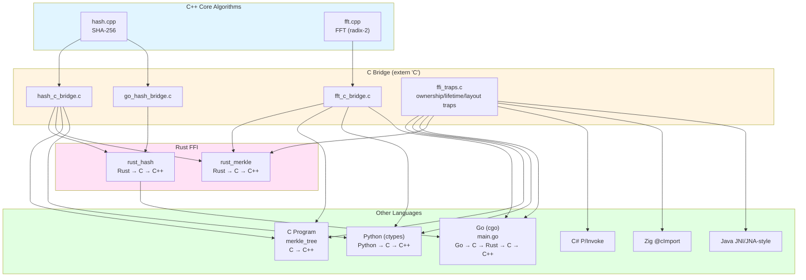

# FFI Demo — Multi-Language Interoperability Test Project

> **⚠️ WARNING: This is a TEST project intentionally containing bugs.**
>
> **Do NOT use this code in production.**

---


### Overview

This project demonstrates Foreign Function Interface (FFI) interoperability across **C/C++, C#, Rust, Go, Python, Zig, and Java**. C++ owns the core algorithms — **SHA-256 hashing** and **Fast Fourier Transform (Cooley-Tukey radix-2)** — while the more interesting defects live at FFI boundaries: ownership, lifetime, ABI layout, callback, and length semantics.

**Primary purpose**: This is a code review training and testing tool designed for the **[OmniScope](https://github.com/Timwood0x10/OmniScope)** project. Source files contain **intentional bugs** (annotated with `// BUG[n]:` or `// BUG[NAME]:`) that test whether an analyzer can follow subtle cross-language resource and lifetime flows.

### Architecture



### FFI Chains

| Language | Hash Chain | FFT Chain |
|----------|-----------|-----------|
| **C** | `C → C (c_hash) → C++ (Hash)` | `C → C (c_fft_forward) → C++ (FFTForward)` |
| **Rust** | `Rust → C (c_hash) → C++ (Hash)` | `Rust → C (c_fft_forward) → C++ (FFTForward)` |
| **Go** | `Go → C (go_hash_bridge) → Rust (rust_hash_compute) → C (c_hash) → C++ (Hash)` | `Go → C (c_fft_forward) → C++ (FFTForward)` |
| **Python** | `Python → C (c_hash) → C++ (Hash)` | `Python → C (c_fft_forward) → C++ (FFTForward)` |
| **C#/Zig/Java** | `language → C trap API` | ownership / layout / callback / length traps |

### Intentional Bugs

All bugs are annotated with `// BUG[n]:` or `// BUG[NAME]:` comments in the source. They are designed to be **subtle and difficult to catch in code review**:

#### Memory Leaks (Primary Bug Category)

| Bug ID | Location | Description | Size |
|--------|----------|-------------|------|
| `LEAK-FD` | `c/hash_c_bridge.c` | `fopen("/dev/urandom")` never closed | 1 fd per process lifetime |
| `LEAK-MALLOC` | `c/hash_c_bridge.c` | `free()` inside `if (len > 0)` — empty input leaks | 1 byte per zero-length hash |
| `FFT-LEAK-1` | `cpp/fft.cpp:InitTwiddle` | `sin_table` allocated but caller only frees `cos_table` | `n/2 * sizeof(double)` per call |
| `FFT-LEAK-2` | `cpp/fft.cpp:BitReverseTable` | Heap allocation only freed on success path | `n * sizeof(size_t)` per FFT |
| `FFT-LEAK-3` | `c/fft_c_bridge.c` | Clone buffers create fragile allocation pattern | `2 * n * sizeof(double)` per FFT |
| `FFT-LEAK-4` | `c/fft_c_bridge.c` | Debug log file descriptor never closed | 1 fd per test_signal call |
| `FFT-LEAK-5` | `c/fft_c_bridge.c` | Temporary string buffer `malloc(256)` never freed | 256 bytes per test_signal call |
| `GO-LEAK-1` | `c/go_hash_bridge.c` | Data clone allocated but never freed | `sizeof(data)` per hash call |
| `GO-LEAK-2` | `c/go_hash_bridge.c` | Clone pointless — original data used instead | Same as above |
| `GO-FFT-LEAK` | `go/main.go` | C arrays allocated but freed only on success path | `2 * n * 8` bytes |

#### Algorithmic & Logic Bugs

| Bug ID | Location | Description |
|--------|----------|-------------|
| BUG[7-8] | `rust_hash/src/lib.rs` | Return value ignored, always returns 0 |
| BUG[9-14] | `rust_merkle/src/lib.rs` | Silent failure, wrong level iteration, uppercase hex |
| BUG[17-20] | `c/merkle_tree.c` | Empty input handling, wrong level_start update |
| BUG[21-24] | `go/main.go` | Error ignored, wrong odd-leaf handling, missing bounds check |
| BUG[25-33] | `python/merkle_tree.py` | Silent fallback, zeroed hash on error, uppercase hex, wrong exit code |

### Building & Running

```bash
# Build everything
make all

# Run all tests
make check

# View LLVM bitcode files
make llvm-bitcode

# Clean build artifacts
make clean
```

### LLVM Bitcode Output

Each compiled language component produces `.bc` (LLVM bitcode) and `.ll` (LLVM IR) files in the `build/` directory:

- `build/cpp/hash.{bc,ll}` — C++ SHA-256
- `build/cpp/fft.{bc,ll}` — C++ FFT
- `build/c/hash_c_bridge.{bc,ll}` — C hash bridge
- `build/c/fft_c_bridge.{bc,ll}` — C FFT bridge
- `build/c/merkle_tree.{bc,ll}` — C Merkle tree
- `build/rust_hash/rust_hash.{bc,ll}` — Rust hash wrapper
- `build/rust_merkle/rust_merkle.{bc,ll}` — Rust Merkle tree

**Note**: Go and Python do not emit LLVM bitcode (Go uses its own gc compiler; Python is interpreted). Their dependencies are available as `.bc` files.

### Project Structure

```
ffi-demo/
├── cpp/              # C++ core algorithms
│   ├── hash.h        # SHA-256 header
│   ├── hash.cpp      # SHA-256 implementation (with bugs)
│   ├── fft.h         # FFT header
│   └── fft.cpp       # FFT Cooley-Tukey implementation (with bugs)
├── c/                # C bridge layer
│   ├── hash_c_bridge.{h,c}   # C wrapper for C++ hash
│   ├── fft_c_bridge.{h,c}    # C wrapper for C++ FFT
│   ├── go_hash_bridge.{h,c}  # C function called by Go -> Rust
│   ├── merkle_tree.{h,c}     # Merkle tree in C
│   └── main.c                # C test program (merkle + FFT)
├── rust_hash/         # Rust crate: extern "C" hash wrapper
│   ├── Cargo.toml
│   └── src/lib.rs
├── rust_merkle/       # Rust crate: Merkle tree + FFT
│   ├── Cargo.toml
│   └── src/
│       ├── lib.rs     # Merkle tree library
│       └── main.rs    # Test binary
├── go/                # Go module: complex FFI chain
│   ├── go.mod
│   └── main.go
├── python/            # Python: ctypes FFI
│   └── merkle_tree.py
├── Makefile           # Build everything
└── README.md          # This file
```

---
