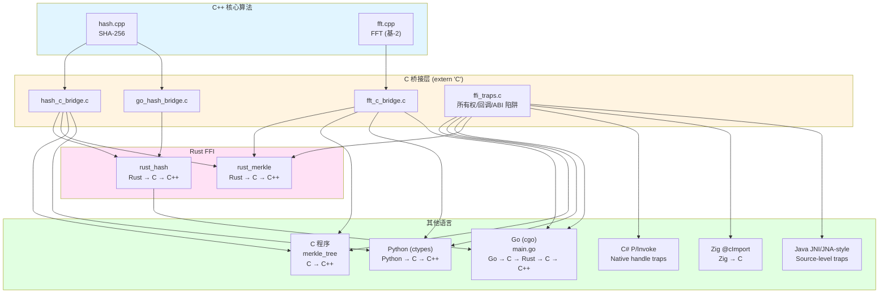

# FFI Demo — Multi-Language Interoperability Test Project

---
> **⚠️ 警告：这是一个测试项目，代码中故意包含有缺陷。**
> **切勿将本项目代码用于生产环境。**


### 概述

本项目演示了 **C/C++、C#、Rust、Go、Python、Zig、Java** 之间的外部函数接口（FFI）互操作性。在 C++ 中实现核心算法——**SHA-256 哈希**和**快速傅里叶变换（Cooley-Tukey 基-2）**；C/C++ 算法层保留少量实现瑕疵，但重点缺陷集中在跨语言 FFI 边界的所有权、生命周期、ABI 布局和长度语义错配。

**主要用途**：这是一个为 **[OmniScope](https://github.com/Timwood0x10/OmniScope)** 项目设计的代码审查训练和测试工具。每个源文件都包含**故意设置的缺陷**（以 `// BUG[n]:` 注释标注），用于测试审查者发现微妙问题的能力——主要是内存泄漏和资源管理错误。

### 架构



### FFI 链

| 语言 | 哈希链 | FFT 链 |
|------|--------|--------|
| **C** | `C → C (c_hash) → C++ (Hash)` | `C → C (c_fft_forward) → C++ (FFTForward)` |
| **Rust** | `Rust → C (c_hash) → C++ (Hash)` | `Rust → C (c_fft_forward) → C++ (FFTForward)` |
| **Go** | `Go → C (go_hash_bridge) → Rust (rust_hash_compute) → C (c_hash) → C++ (Hash)` | `Go → C (c_fft_forward) → C++ (FFTForward)` |
| **Python** | `Python → C (c_hash) → C++ (Hash)` | `Python → C (c_fft_forward) → C++ (FFTForward)` |
| **C#** | `C# → P/Invoke → C trap API` | allocator / borrowed pointer / length traps |
| **Zig** | `Zig → @cImport → C trap API` | ownership / alias / exact-buffer traps |
| **Java** | `Java → JNI/JNA-style native handles → C trap API` | source-level handle ownership traps |

### 故意设置的缺陷

所有缺陷都在源码中以 `// BUG[n]:` 或 `// BUG[NAME]:` 注释标注。这些缺陷设计得**非常微妙，在代码审查中很难发现**：

#### 内存泄漏（主要缺陷类别）

| Bug ID | 位置 | 描述 | 影响 |
|--------|------|------|------|
| `LEAK-FD` | `c/hash_c_bridge.c` | `fopen("/dev/urandom")` 从未关闭 | 每个进程泄漏 1 个 fd |
| `LEAK-MALLOC` | `c/hash_c_bridge.c` | `free()` 在 `if (len > 0)` 内——空输入泄漏 | 每次零长度哈希泄漏 1 字节 |
| `FFT-LEAK-1` | `cpp/fft.cpp:InitTwiddle` | `sin_table` 已分配但调用者只释放 `cos_table` | 每次调用泄漏 `n/2 * 8` 字节 |
| `FFT-LEAK-2` | `cpp/fft.cpp:BitReverseTable` | 堆分配仅在成功路径上释放 | 每次 FFT 泄漏 `n * 8` 字节 |
| `FFT-LEAK-3` | `c/fft_c_bridge.c` | 克隆缓冲区形成脆弱分配模式 | 每次 FFT 泄漏 `2 * n * 8` 字节 |
| `FFT-LEAK-4` | `c/fft_c_bridge.c` | 调试日志文件描述符从未关闭 | 每次 test_signal 调用泄漏 1 个 fd |
| `FFT-LEAK-5` | `c/fft_c_bridge.c` | 临时字符串缓冲区 `malloc(256)` 从未释放 | 每次 test_signal 调用泄漏 256 字节 |
| `GO-LEAK-1` | `c/go_hash_bridge.c` | 数据克隆已分配但从未释放 | 每次哈希调用泄漏 `sizeof(data)` 字节 |
| `GO-LEAK-2` | `c/go_hash_bridge.c` | 克隆毫无意义——实际使用了原始数据 | 同上 |
| `GO-FFT-LEAK` | `go/main.go` | C 数组已分配但仅在成功路径上释放 | 每次 FFT 泄漏 `2 * n * 8` 字节 |

#### FFI 边界陷阱（新增重点）

| Bug ID | 位置 | 描述 | 重点能力 |
|--------|------|------|----------|
| `TRAP-C-1` | `c/ffi_traps.c` | C 返回 owning `malloc` 字符串，但绑定层容易当 borrowed 用 | 跨语言所有权识别 |
| `TRAP-C-2` | `c/ffi_traps.c` | 返回 borrowed static buffer，API 形状近似 owning 指针 | invalid free / API 语义区分 |
| `TRAP-C-3` | `c/ffi_traps.c` | `struct ffi_packet` 含 padding、`size_t`、指针字段 | ABI/布局错配 |
| `TRAP-C-4` | `c/ffi_traps.c` | 上层 `usize/long` 到 C `uint32_t` 的长度截断诱饵 | 整数截断跨 FFI 追踪 |
| `TRAP-C-5` | `c/ffi_traps.c` | exact-size output 下 NUL 终止符越界写 | 边界条件越界 |
| `TRAP-C-6` | `c/ffi_traps.c` | callback registry 保存 stack pointer，延迟触发 | 分离式生命周期/UAF |
| `TRAP-C-7` | `c/ffi_traps.c` | 返回 caller-owned buffer 的内部别名 | alias ownership / 悬垂引用 |
| `GO/RUST/PY/CS/ZIG/JAVA-FFI-*` | 各语言入口 | 对 trap API 的错误绑定和清理策略 | 跨语言污点与所有权传播 |

#### 算法与逻辑缺陷

| Bug ID | 位置 | 描述 |
|--------|------|------|
| BUG[7-8] | `rust_hash/src/lib.rs` | 忽略返回值，始终返回 0 |
| BUG[9-14] | `rust_merkle/src/lib.rs` | 静默失败，错误层级迭代，大写十六进制 |
| BUG[17-20] | `c/merkle_tree.c` | 空输入处理错误，`level_start` 更新错误 |
| BUG[21-24] | `go/main.go` | 忽略错误，错误奇数叶子处理，缺少边界检查 |
| BUG[25-33] | `python/merkle_tree.py` | 静默回退，错误时返回零哈希，大写十六进制，错误退出码 |

### 构建与运行

```bash
# 构建全部
make all

# 运行所有测试
make check

# 查看 LLVM 比特码文件
make llvm-bitcode

# 清理构建产物
make clean
```

### LLVM 比特码输出

每个编译型语言组件在 `build/` 目录下生成 `.bc`（LLVM 比特码）和 `.ll`（LLVM IR）文件：

- `build/cpp/hash.{bc,ll}` — C++ SHA-256
- `build/cpp/fft.{bc,ll}` — C++ FFT
- `build/c/hash_c_bridge.{bc,ll}` — C 哈希桥接
- `build/c/fft_c_bridge.{bc,ll}` — C FFT 桥接
- `build/c/merkle_tree.{bc,ll}` — C Merkle 树
- `build/rust_hash/rust_hash.{bc,ll}` — Rust 哈希包装
- `build/rust_merkle/rust_merkle.{bc,ll}` — Rust Merkle 树

**注意**：Go 和 Python 不生成 LLVM 比特码（Go 使用自己的 gc 编译器；Python 是解释型语言）。它们的依赖项以 `.bc` 文件形式提供。

### 项目结构

```
ffi-demo/
├── cpp/              # C++ 核心算法
│   ├── hash.h        # SHA-256 头文件
│   ├── hash.cpp      # SHA-256 实现（含缺陷）
│   ├── fft.h         # FFT 头文件
│   └── fft.cpp       # FFT Cooley-Tukey 实现（含缺陷）
├── c/                # C 桥接层
│   ├── hash_c_bridge.{h,c}   # C++ 哈希的 C 包装
│   ├── fft_c_bridge.{h,c}    # C++ FFT 的 C 包装
│   ├── ffi_traps.{h,c}       # 隐蔽 FFI 所有权/布局/生命周期陷阱
│   ├── go_hash_bridge.{h,c}  # Go → Rust 调用的 C 函数
│   ├── merkle_tree.{h,c}     # C 语言 Merkle 树
│   └── main.c                # C 测试程序（Merkle + FFT）
├── rust_hash/         # Rust crate: extern "C" 哈希包装
│   ├── Cargo.toml
│   └── src/lib.rs
├── rust_merkle/       # Rust crate: Merkle 树 + FFT
│   ├── Cargo.toml
│   └── src/
│       ├── lib.rs     # Merkle 树库
│       └── main.rs    # 测试二进制
├── go/                # Go 模块: 复杂 FFI 链
│   ├── go.mod
│   └── main.go
├── python/            # Python: ctypes FFI
│   └── merkle_tree.py
├── csharp/            # C#: P/Invoke FFI 陷阱
├── zig/               # Zig: @cImport FFI 陷阱
├── java/              # Java: JNI/JNA-style source-level FFI 陷阱
├── Makefile           # 构建全部
└── README.md          # 本文件
```
